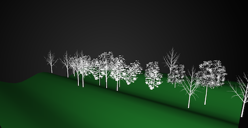
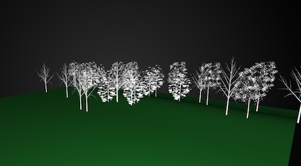

# FFTerrain

### Alex Esposito 6/1/15

This project was meant to showcase soundwaves in a 3D terrain and give it that feeling of being a forest. The idea was to visualize sound in a creative way in order to teach young students about sound and image manipulation in a more creative way, sadly I don't think my goal came across. There were parts of this that I assumed would be easy, but quickly became the most challenging aspects of what I attempted to do.

This project was my attempt at using 3D models and meshes in Open Frameworks. There is still a lot I don't understand about whats going on in 3D coding and I feel like although I made strides in my own head towards understanding this stuff, it doesn't show through the code. After spending time with the ofxFFT addon and getting the right sound to manipulate I spent well over 14 hours trying to make something even work within the program. After failing over and over again I went on to the brute force tactic and forcefully loaded 30 tree models in to the program, gave them all there own random integer to spawn at on the grid, and lastly drew and rotated all 30 of them individually. After all of this I again went back to trying to improve the image, Add texture, different colors, more variety, but it all resulted in frustration. This project showed me a lot about how little I know in terms of 3D coding and I need to spend a lot more time before I feel compfortable actually publishing this idea any further.